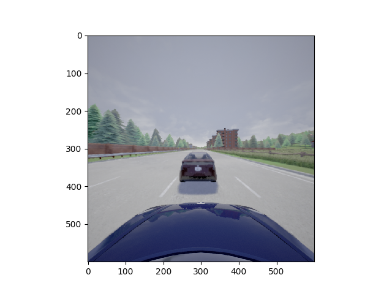

Mini-Project 2: Perception-based Adaptive Cruise Control in CARLA
=========================================

## Overview

In this part of the mini-project, we will estimate the distance between the host car and the lead car from video data and pass these estimated values to the ACC module created in Mini-Project 1.

The video data is already passed into file `predictor.py`. The image at each frame is a numpy array of size (600,600,3). Here are three examples:
<!--  {:height="36px" width="36px"} -->
<p align="center">

</p>


## Project Structure
```
csci513-miniproject2                    # root directory
  ├── camera_images                     # sample images to pass to distance NN
  ├── Carla.def                         # Definition file for Singularity
  ├── Carla.Dockerfile                  # Dockerfile to set up the CARLA simulator
  ├── data                              # Directory to store datasets
  │   ├── test.csv          
  │   |── train.csv
  ├── HPC-Instructions.md
  ├── lane_data                         # Image data
  |   ├── ado_in_lane
  |   ├── ado_not_in_lane
  ├── logs                              # Directory to store log files
  ├── Makefile                          # Makefile to easily run things
  ├── mp2_controller
  │  ├── __init__.py
  │  └── controller.py                  # Adjust speed of car using PID controller.
  ├── mp2_distance_predictor
  │   ├── carlane_model_weights
  │   ├── check_lane.py                 
  │   ├── detect.py
  │   ├── distance_model_weights
  │   ├── inference_distance.py
  │   ├── __init__.py
  │   ├── __main__.py                   
  │   ├── predictor.py                  
  │   └── yolo_model.h5                 # Where trained model weights are stored
  ├── mp2_evaluation
  │   ├── __init__.py
  │   ├── __main__.py                   # Scripts to evaluate controller
  ├── mp2_simulator
  │  ├── __init__.py
  │  ├── __main__.py                    # The test runner
  │  ├── misc.py
  │  ├── render.py
  │  └── simulator.py                   # An interface to the simulator
  ├── pyproject.toml
  ├── README.md
  ├── setup.cfg
  ├── setup.py
```

## Task
The basic operation of ACC is as follows: the driver sets a desired cruise speed `desired_speed` that is assumed to be constant across this project. If the distance between the host car and the lead car is greater than the safe distance `distance_threshold`, then the host car attempts to travel at the desired cruise speed. If the distance between the host car and the lead car is less than the safe distance, then the host car tries to maintain at least a safe distance from the lead car.

The inputs to the ACC are the desired cruise speed for the host car, the estimated distance between the lead car and the host car, and the host car's velocity. The output of the ACC-based controller is the acceleration value for the host car between -10 to 10.

In each step of the simulation, the simulator will take the data from the camera sensor on-board the ego car, and pass it onto your mp2_distance_predictor module. The predicted distance is then passed back to the controller you designed in Mini-Project 1 to
safely control the adaptive cruise controller.

As you can see, most of the files remain the same as in the previous part. The main file
you need to edit is `mp2_distance_predictor/predictor.py` and `mp2_distance_predictor/check_lane.py`.

The code for visualizing the image is in the file `mp2_simulator/__main__.py` at `line 96`.
You could even try to build a new dataset specifically for carla environment.
You can plot the object detection results by uncommenting `line 234` in file `detect.py`. It will pop up an image for each frame, with bounding box on ado car.

Note: Initial distance between ado and ego is `20`.


You tasks:
  1. Train a Neural Network model that can predict the distance to the lead car.
  2. Train a Neural Network model  to predict if the ado car is in the same lane as ego car or not.
  3. Use your Controller from Mini-Project 1.
  4. Run the simulator and evaluate the controller.


## Setup

In all instances you need to have the following prerequisite packages installed:

1. Python 3.8
2. Pip >= 21

Use the same setup as in Part A for CARLA.

There are new required libraries for the project, so we need to update the python environment. 
From the current project directory, run

```shell
$ pip install -e .
```
This command will install the project dependencies, and allow you to run the simulations
easily.

## Training the distance neural network
You need to train a Neural Network to predict distance to  the ado car.
We have included a skeleton of a network in `mp2_distance_predictor/__main__.py`. 
This pipeline uses the pretrained YOLOv3 model to perform image segmentation, and we only handle
distance prediction from the provided bounding boxes. 

Note: In lines 54 and 57, if you are working on the HPC, add the entire path (you can get this by using the 'pwd' command)
so it should look like "/home1/<username>/csci513-miniproject2/mp2_distance_predictor/distance_model_weights/{}.json" and similarly for the .h5 file.

In order to train the NN, run
```shell
$ python -m mp2_distance_predictor
```

The script will save the resulting weights in `mp2_distance_predictor/distance_model_weights/distance_model.h5` to 
be loaded by the simulator. 

**NOTE:** Tensorflow has issues where it allocates too much memory on the GPU, and this can
cause both, Tensorflow _and_ CARLA to hang.

Some resources:

- [Deep Learning In 60
  Minutes](https://pytorch.org/tutorials/beginner/deep_learning_60min_blitz.html)
- [Training an Object
  Detector](https://www.pyimagesearch.com/2021/11/01/training-an-object-detector-from-scratch-in-pytorch/)


## Training the segmentation neural network [OPTIONAL]

For this part of the project you will need to use a dataset to train your neural network
to predict distances. We recommend using the
[KITTI](http://www.cvlibs.net/datasets/kitti/) to train the distance predictor. If you
are using PyTorch, the easiest way to get started is by using
[`torchvision.datasets`](https://pytorch.org/vision/stable/datasets.html#kitti).
Otherwise, if you're using Tensorflow, you can use
[`tfds.object_detection.Kitti`](https://www.tensorflow.org/datasets/catalog/kitti).

Otherwise, the [KITTI MoSeg](http://webdocs.cs.ualberta.ca/~vis/kittimoseg/) dataset is
a great, low download size, alternative to the above methods. In this case, note that
each .png file in the images folder corresponds to a video frame. We recommended using
one of the following videos for training (but feel free to use other videos in the
dataset): `2011_09_26_drive_0018`, `2011_09_26_drive_0057`, `2011_09_26_drive_0059`.

This part is marked optional as the code is already integrated with a pretrained YOLOv3 
network to handle segmentation.  


## Training the lane check neural network
You need to train a Neural Network to predict if the ado car is in the same lane as ego car or not
We have included a skeleton pipeline in `mp2_distance_predictor/check_lane.py`. 
You can use the pretrained YOLOv3 model to perform image segmentation.
Check `mp2_distance_predictor/check_lane.py` for more details.
You can change the `mp2_distance_predictor/check_lane.py` however you want.

Note: As earlier, if you are working on the HPC, edit the path to the .json and .h5 files to include the whole paths so that they look like: 
"/home1/<username>/csci513-miniproject2/mp2_distance_predictor/carlane_model_weights/{}.json" and "/home1/<username>/csci513-miniproject2/mp2_distance_predictor/carlane_model_weights/{}.h5"

In order to train the lane check NN, run

```shell
$ python3  mp2_distance_predictor/check_lane.py
```

Save the resulting weights in `mp2_distance_predictor/carlane_model_weights/car_lane_model.h5`.


### Minor issues you may run into

1. The camera information doesn't match due to positioning of the simulated camera:

   To fix this, play around with the `CAMERA_POSITION` dictionary in
   `./mp2_simulator/simulator.py` (line 45).


## Running the simulations.

1. Start Carla, either from a terminal window (using Docker or otherwise) or by simply
   launching the CarlaUE4 executable.

```shell
$ ./CarlaUE4.sh -RenderOffScreen
```

2. In the other terminal, start the controller:
```shell
$ python3 -m mp2_simulator --n-episodes 1
```

You can also run the following to see what options you have for the test runner. 
```shell
$ python3 -m mp2_simulator --help
```

When you run the script, for every episode run by the script, it will save a CSV file in
the `logs/` directory. These CSV files (or _traces_) are a recording of the simulation
consisting of only the state variables we deem necessary for evaluating your design.

## Evaluating your design

In this assignment, we will use Signal Temporal Logic (STL) requirements to ensure the
correctness of the controller. To do this, we use the [RT-AMT][rtamt] package (installed
automatically) to define offline monitors for your controller.

[rtamt]: https://github.com/nickovic/

To evaluate the traces you've captured for your controller, simply run the following
command:
```shell
$ python3 -m mp2_evaluation <list of log files>
```
where `<list of log files>` is a placeholder for all the CSV files you need to evaluate.
An example (assuming you are saving the files in `logs/` directory) would be:
```shell
$ python3 -m mp2_evaluation logs/*
```
which will evaluate all the files in that directory.
